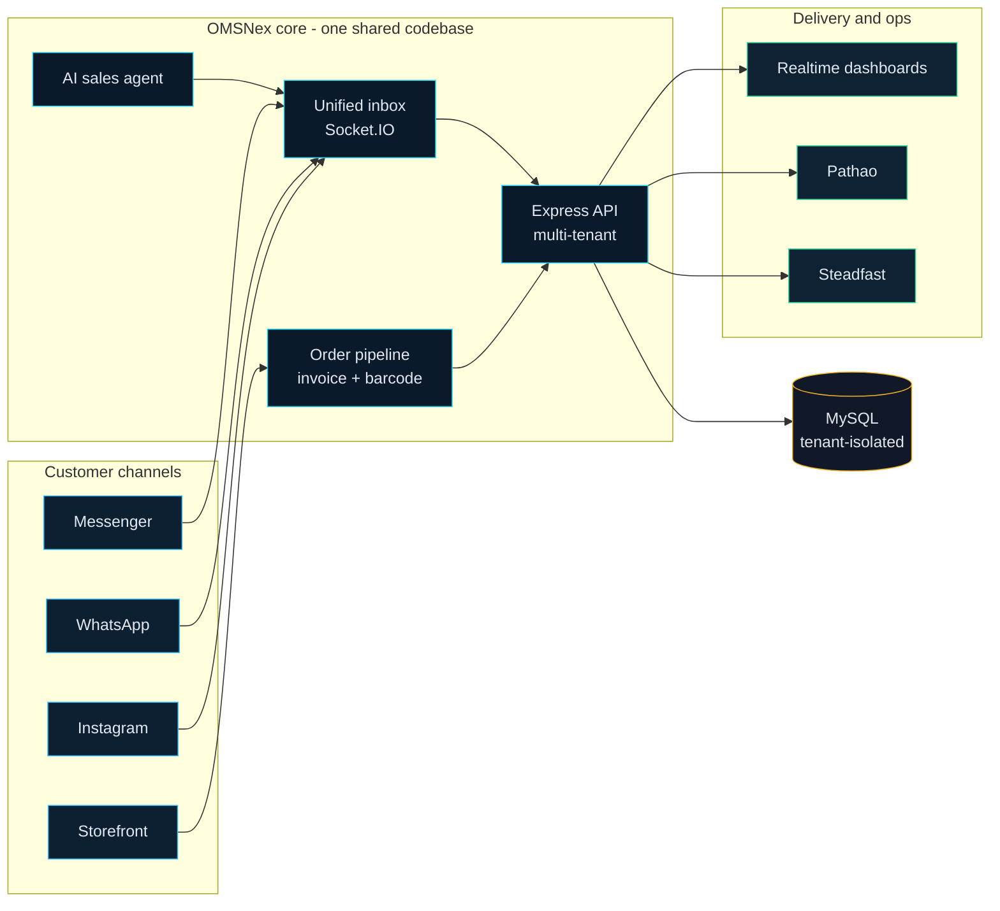

<div align="center">
  
</div>

<div align="center">

[](https://abdussadir.com)
[](https://linkedin.com/in/abdussadir)
[](https://twitter.com/abdussadir)
[](mailto:sadir8042@gmail.com)


[](https://github.com/abdussadir?tab=followers)


</div>

---

## `▍` whoami

```jsonc
{
  "name":     "MD Abdus Sadir",
  "role":     "Full-Stack Web Developer",
  "based_in": "Dhaka, Bangladesh",
  "building": "OMSNex — multi-tenant order management & CRM SaaS",
  "runtime":  ["Node.js", "Express", "MySQL", "Socket.IO"],
  "obsessed_with": ["tenant isolation", "one source of truth", "small verified slices"],
  "started_with":  "a plain index.html — and never stopped shipping"
}
```

Self-taught developer from Bangladesh. I don't build demos — I build the software real
businesses run their day on: order pipelines that must not lose a row, courier automation
that must not double-ship, and dashboards people stare at while money moves.

---

## `▍` how OMSNex fits together



> One codebase, many tenants. A feature lives in exactly one place — and both products consume it.

---

## `▍` currently shipping

<table>
<tr>
<td width="50%" valign="top">

### 🛰️ [OMSNex](https://omsnex.com)

Multi-tenant order management & CRM SaaS for e-commerce teams.
Courier automation, unified messaging, real-time ops.

`Node.js` `Express` `MySQL` `Socket.IO`

</td>
<td width="50%" valign="top">

### 🧭 [BD Easy Shop](https://www.bdeasyshop.xyz)

Admin control plane powering the platform — the panel
the whole operation is driven from.

`pnpm` `Turborepo` `monorepo`

</td>
</tr>
<tr>
<td width="50%" valign="top">

### 🛒 [Ghorer Bazar](https://github.com/abdussadir/ghorerbazar)

Responsive e-commerce storefront front-end, built
mobile-first for real BD shoppers.

`HTML5` `CSS3` `Bootstrap 5`

</td>
<td width="50%" valign="top">

### 🎯 [abdussadir.com](https://abdussadir.com)

My personal site — work, services and contact.
Hand-built, no page builder.

`HTML5` `CSS3` `JavaScript`

</td>
</tr>
</table>

---

## `▍` stack

<div align="center">


<br>


</div>

<details>
<summary><b>›&nbsp; the full inventory</b></summary>

<br>

| Layer | What I reach for | Why |
| :--- | :--- | :--- |
| **Runtime** | Node.js · Express | Fast to ship, easy to keep boring and predictable |
| **Data** | MySQL · schema-first migrations | Orders are money — I want constraints, not vibes |
| **Realtime** | Socket.IO | Live inboxes and dashboards without hammering the DB |
| **Frontend** | JavaScript · HTML5 · CSS3 · Bootstrap 5 | Hand-written UI, no framework tax where it isn't earned |
| **Delivery** | Git · GitHub Actions · pnpm · Turborepo | One command from commit to production |
| **Integrations** | Steadfast · Pathao · Messenger · WhatsApp · Instagram | The APIs Bangladeshi e-commerce actually runs on |
| **Also fluent in** | WordPress · PHP · REST API design | Where a lot of clients already live |

</details>

<details>
<summary><b>›&nbsp; how I work</b></summary>

<br>

- **Production data comes first.** No feature is worth a corrupted order table.
- **Share code, never tenant data.** Strict isolation at every boundary, by default.
- **Small, verified slices.** Read the existing code → smallest safe change → test → ship.
- **End to end or not done.** Design, build, test, deploy — "it works locally" is not a status.
- **Say it plainly.** If something failed, I say it failed. No green checkmarks over red builds.

</details>

<details>
<summary><b>›&nbsp; what I'm sharpening next</b></summary>

<br>

- Deeper TypeScript across the monorepo
- Queue-backed job processing for courier and messaging retries
- Observability: structured logs, tenant-scoped tracing, real error budgets
- Cost-aware AI agents that actually close sales instead of just replying

</details>

---

## `▍` github

<div align="center">

<picture>
  <source media="(prefers-color-scheme: dark)" srcset="https://github-readme-stats.vercel.app/api?username=abdussadir&show_icons=true&hide_border=true&count_private=true&include_all_commits=true&bg_color=0b1a2b&title_color=22d3ee&icon_color=34d399&text_color=cbd5e1&ring_color=38bdf8">
  
</picture>
<picture>
  <source media="(prefers-color-scheme: dark)" srcset="https://github-readme-stats.vercel.app/api/top-langs/?username=abdussadir&layout=compact&langs_count=8&hide_border=true&bg_color=0b1a2b&title_color=22d3ee&text_color=cbd5e1">
  
</picture>

<br><br>

<picture>
  <source media="(prefers-color-scheme: dark)" srcset="https://github-readme-streak-stats.herokuapp.com/?user=abdussadir&hide_border=true&background=0b1a2b&stroke=1e3a4c&ring=22d3ee&fire=34d399&currStreakLabel=22d3ee&sideLabels=cbd5e1&dates=64748b">
  
</picture>

<br><br>

<!-- Generated automatically by .github/workflows/snake.yml -->
<picture>
  <source media="(prefers-color-scheme: dark)" srcset="https://raw.githubusercontent.com/abdussadir/abdussadir/output/snake-dark.svg">
  
</picture>

</div>

---

## `▍` let's build something

I take on freelance work and collaborations on **web applications, e-commerce platforms and
SaaS products** — especially anything that has to survive real traffic and real money.

<div align="center">

**📫 [sadir8042@gmail.com](mailto:sadir8042@gmail.com)** &nbsp;·&nbsp; **🌐 [abdussadir.com](https://abdussadir.com)** &nbsp;·&nbsp; **💼 [LinkedIn](https://linkedin.com/in/abdussadir)**

<br>


</div>
